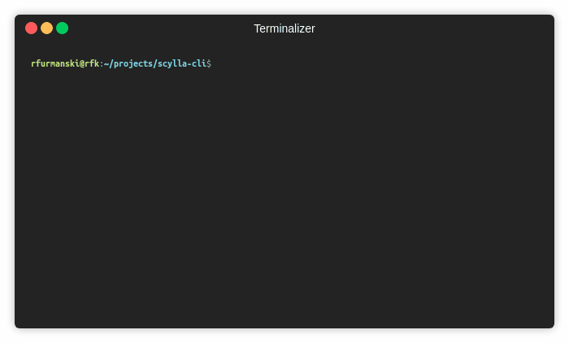

# scylla-cli

Terminal tool for managing and repairing Scylla Cluster.


## Prerequisites

* SSH connection to every Scylla host in the cluster should be possible
* Scylla REST API listens on :10000

Following env variables could be set to make your life easier:
```
export SCYLLA_HOST='10.210.92.46'
export SCYLLA_USERNAME='root' # ssh user on Scylla host
export SCYLLA_PKEY='/home/USER/.ssh/id_rsa' # Defaults to ~/.ssh/id_rsa
```

## Installation

```
pipenv --three install scylla-cli
```
or
```
pipsi install scylla-cli
```

or

```
pip3 install scylla-cli
```

## Developing
```
virtualenv -p python3 scylla-cli
pip3 install --editable .
```

## Checking cluster status
```
scli status
```


## Repairing Scylla Cluster
```
# connect to the cluster via 10.210.92.46 with root credentials and repair
# sync keyspace on every endpoint in local DC only
$ scli -u root -p repair sync --local

# connect to the cluster via 10.210.92.46 with root credentials and repair
# sync keyspace on 10.210.92.46 only
$ scli -u root -p repair sync --local --hosts 10.210.92.46

# connect to the cluster via 10.210.92.46 with root credentials and repair
# sync keyspace on every host except 10.210.92.46
$ scli -u root -p repair sync --local --exclude 10.210.92.46
```
